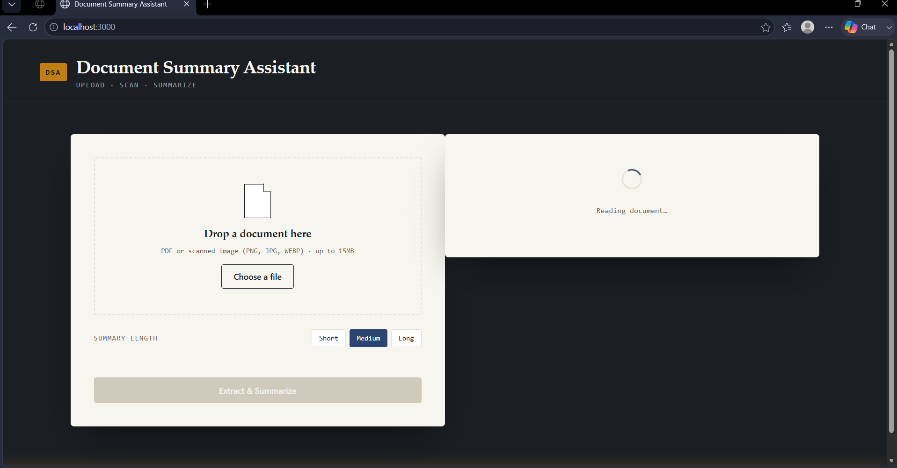
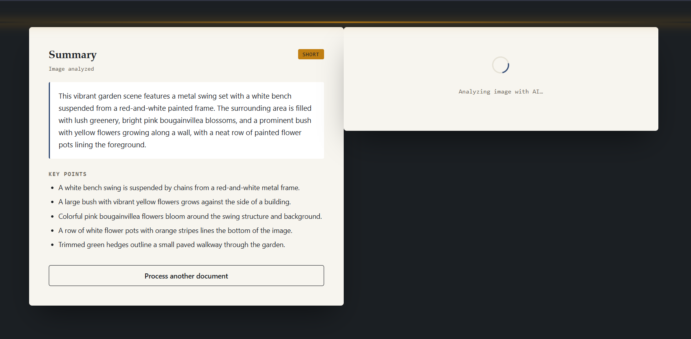

# Document Summary Assistant

A lightweight AI-powered web application that extracts and summarizes content from PDFs and images. Choose short, medium, or long summaries and receive five key points highlighting the most important information.

Highlights

- Fast, browser-based UX with a small Node/Express backend for document processing
- Supports PDFs and common image formats (PNG/JPG/JPEG/WEBP)
- OCR support for scanned documents via Tesseract.js
- AI summarization and multimodal image understanding via Google Gemini (`@google/genai`)
- Extractive fallback summarization for PDFs when the LLM is unavailable

Screenshots

Input interface



AI-generated summary




### Live Deployment
The application is deployed on Vercel.


Features

- Drag-and-drop and file picker upload
- PDF text extraction (pdf-parse / PDF.js)
- OCR for photographed/scanned pages using Tesseract.js
- Gemini-powered text summarization and Gemini Vision for visual analysis
- Short / Medium / Long summary presets
- Automatic generation of 5 key points per document
- Friendly loading states and error handling
- Mobile-responsive front-end

How it works (high level)

- PDF: PDF text extraction → (optionally extractive fallback) → Gemini → Summary + key points
- Image with readable text: OCR (Tesseract.js) → Gemini → Summary + key points
- Image without readable text: Gemini Vision → Visual analysis → Summary + key points

Tech stack

- Frontend: HTML5, CSS3, JavaScript
- Backend: Node.js, Express, Multer (file uploads)
- Document processing: pdf-parse / PDF.js, Tesseract.js (OCR)
- AI: Google Gemini via the `@google/genai` client

Environment variables

- GEMINI_API_KEY (required to enable AI summarization and vision features)

For local development, create a `.env` file in the project root (ensure `.env` is in `.gitignore`):

```
GEMINI_API_KEY=your_api_key_here
```

Quick start (local)

1. Clone the repository:

   ```bash
   git clone https://github.com/YOUR_USERNAME/document-summary-assistant.git
   cd document-summary-assistant
   ```

2. Install dependencies:

   ```bash
   npm install
   ```

3. Add your Gemini API key to `.env` as shown above.

4. Start the app:

   ```bash
   npm start
   ```

5. Open your browser at:

   http://localhost:3000

Usage

1. Open the app in your browser.
2. Drag-and-drop or choose a PDF/image file.
3. Select summary length (Short / Medium / Long).
4. Click to process and wait for the results.
5. Read the summary and review the five key points. Use "Process another document" to analyze a new file.

Error handling & fallback behavior

- Unsupported file types, oversized files, OCR failures, and API errors are detected and surfaced with clear messages in the UI.
- If the Gemini API is unavailable or rate-limited, the app falls back to an extractive PDF summarizer so users can still get meaningful summaries.

Testing checklist

- Verify short/medium/long summaries for both PDFs and images.
- Test scanned images with readable text to confirm OCR → text extraction → summary.
- Confirm UI shows loading states and appropriate error messages when processing fails.

Deployment notes

This app can be deployed to any Node-compatible host (Render, Railway, Heroku, etc.).

Deployment checklist

1. Push repository to your Git provider (e.g., GitHub).
2. Configure the host to run `npm install` and start with `node server.js` (or `npm start`).
3. Add `GEMINI_API_KEY` as an environment variable in the hosting dashboard.

Project structure (overview)

```
server.js          # Express server: upload handling, extraction, summarization
public/             # Static frontend assets
  index.html        # UI markup
  style.css         # Styling
  script.js         # Upload/drag-drop/fetch logic
screenshots/        # Example screenshots referenced above
```

Limitations & future improvements

- Complex multi-column PDFs can extract text out of logical order; consider layout-aware parsing for better fidelity.
- OCR accuracy varies with image quality; preprocessing (deskew, contrast) could improve results.
- Add optional user settings for summary length granularity, language selection, and output formats (PDF / TXT).

Contributing

Contributions, issues, and feature requests are welcome. If you'd like to contribute:

1. Fork the repository
2. Create a feature branch
3. Submit a pull request describing your change

License

Specify your license here (e.g., MIT). Replace this line with your chosen license and add a LICENSE file.

Acknowledgements

- Google Gemini (`@google/genai`) for the LLM / vision features
- Tesseract.js for OCR
- pdf-parse / PDF.js for PDF text extraction

Contact

For questions or help, open an issue or contact the repository owner.
